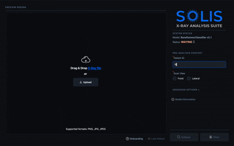

# Bone Tumour Classifier Application
> A cross-platform C++ desktop application that leverages a custom-trained deep learning model to analyse and classify bone tumours from medical imaging.
>
> ---
>
> ## 🎬 See It In Action
>
> 
> 
> *An example of the Qt GUI dashboard performing real-time inference using the exported ONNX model.*
>
> ---
>
> ## Project Architecture & Overview
> This repository bridges computer vision training in Python with a fast, native C++ desktop interface.
> 
> 🧬 Data Science & Model Training
> 
> + The model training workflow is contained entirely within the notebooks/ directory.
> + Dataset Setup: The system utilises a dataset structured with images/, labels/, and a data.yaml layout
> + Training Pipeline (notebooks/train_pipeline.ipynb): Fetches data, processes the medical scans, trains the neural network, and handles parameter tuning.
>
> 💡 Core Application Components
> 
> + bonetumourclassifier: Core logic managing the ONNX Runtime session, handling tensor preprocessing, and running the inference loop.
> + analysisdashboard: The primary UI window providing users with diagnostics, metrics, and visual outputs.
> + animatedstackedwidget: Fluid UI transitions between dashboard views for better user experience.
> + editdiagnosisdialog & reportinfodialog: Interactive alternative to QMessageBox allowing full customisation of signals which require input changes.
